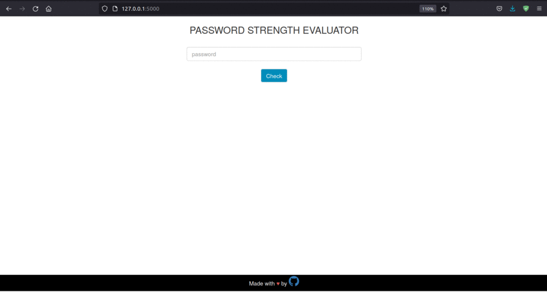

# PASSWORD STRENGTH EVALUATOR

Evaulates strength of password entered by user using Machine learning models.

# Demo



## Installation

To run this project

* Create a virtual environment like
    
```bash
  virtualenv venv37 -p python3
```
* Activate the environment

    If linux: 
```bash
    sourve venv37/bin/activate 
```
 If Windows, go inside venv37\Scripts folder using terminal and run activate


* Install all required libaries
```bash
    pip install -r requirements.txt
```

* Jupyter notebook steps:

    * If you already have jupyter notebook installed, then on terminal, run:

    ```
        jupyter notebook 
    ```
    * If jupyter is not installed follow either of these steps:
        * https://towardsdatascience.com/creating-and-using-virtual-environment-on-jupyter-notebook-with-python-db3f5afdd56a
        * https://towardsdatascience.com/how-to-set-up-anaconda-and-jupyter-notebook-the-right-way-de3b7623ea4a

    * Then run each line of jupyter notebook so our model is created

    * If you don't want to run jupyter notebook steps, I have already created models and they are saved in repo having names **vectorizer.pkl** and **xgb_classifier.pkl**

* With virtual environment actiavated in the terminal run
    ```
        python main.py
    ```

## Tech Stack

**Frontend:** HTML, Css, JavaScipt, Jinja

**Backend:** Python with Flask, Jupyter Notebook  